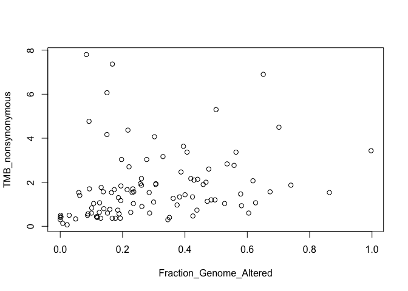
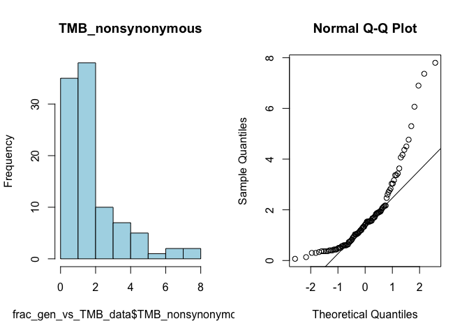

midterm1
================
Alex Pinto
2025-05-04

## Preparation - Loading Data

``` r
clinical_data <- read.csv("TCGA_BRCA_clinical_data.csv", header=TRUE)
mRNA_exp <- read.csv("TCGA_BRCA_mRNA_expression.csv", header=TRUE)
protein_exp <- read.csv("TCGA_BRCA_RPPA_protein_expression.csv", header=TRUE)
```

## Question 1

*1. 10 points Investigate whether the ERBB2 (HER2) mRNA expression is
significantly different between normal and tumor tissues. Perform both
an unpaired t-test and a paired t-test. Clearly explain the results from
each test and discuss which test is more appropriate for answering this
question. Ensure that you state the null hypothesis clearly and indicate
whether you accept or reject it based on the results obtained.*<br>

To begin, I split up the samples between normal and tumor tissue types,
while also removing NA’s. I noticed that the tumor tissue types had a
suffix of \_01 and the normal tissue types had a suffix of \_11, so I
used grep to get the associated columns.

``` r
# get all the tumor and normal column names
tumor_cols <- grep("_01$", colnames(mRNA_exp), value = TRUE)
normal_cols <- grep("_11$", colnames(mRNA_exp), value = TRUE)

# extract gene exp data from each, get rid of NA's
erbb2_tumor <- mRNA_exp[mRNA_exp$X == "ERBB2", tumor_cols]
erbb2_tumor <- erbb2_tumor[!is.na(erbb2_tumor)]

erbb2_normal <- mRNA_exp[mRNA_exp$X == "ERBB2", normal_cols]
erbb2_normal <- erbb2_normal[!is.na(erbb2_normal)]
```

In order to get a sense of the data and look for any skew, I wanted to
plot a histogram and a box plot.

``` r
par(mfrow=c(1,2))

boxplot(erbb2_normal,
        main="ERBB2 Normal",
        col="lightblue",
        horizontal=TRUE
        )

hist(erbb2_normal,
     main="ERBB2 Normal",
     col="lightblue")
```

<!-- -->

``` r
boxplot(erbb2_tumor,
        main="ERBB2 Tumor",
        col="lightblue",
        horizontal=TRUE
        )

hist(erbb2_tumor,
     main="ERBB2 Tumor",
     col="lightblue")
```

<!-- -->

We can see that both samples have expression data that skew far to the
right, but the tumor data has a very extreme skew to the right. Let’s
try a transformation by using the sqrt()

``` r
par(mfrow=c(1,2))

erbb2_normal_trans <- sqrt(erbb2_normal)
erbb2_tumor_trans <- sqrt(erbb2_tumor)

boxplot(erbb2_normal_trans,
        main="ERBB2 Normal",
        col="lightblue",
        horizontal=TRUE
        )

hist(erbb2_normal_trans,
     main="ERBB2 Normal",
     col="lightblue")
```

<!-- -->

``` r
boxplot(erbb2_tumor_trans,
        main="ERBB2 Tumor",
        col="lightblue",
        horizontal=TRUE
        )

hist(erbb2_tumor_trans,
     main="ERBB2 Tumor",
     col="lightblue")
```

<!-- --> <br>This seemed
to help the erbb2_normal data, but the erbb2 tumor data are still very
skewed. Let’s inspect this further with Shapiro-Wilk’s normality test.

``` r
shapiro.test(erbb2_tumor_trans)
```

    ## 
    ##  Shapiro-Wilk normality test
    ## 
    ## data:  erbb2_tumor_trans
    ## W = 0.57695, p-value = 9.313e-16

``` r
shapiro.test(erbb2_normal_trans)
```

    ## 
    ##  Shapiro-Wilk normality test
    ## 
    ## data:  erbb2_normal_trans
    ## W = 0.97907, p-value = 0.1021

It looks like with a low p-value of 9.3e-16 for erbb2_tumor_trans, we
have to reject the null hypothesis that the data are normally
distributed. However, for the erbb2_normal_trans, we can keep the null
hypothesis that the gene expression data are normally distributed.
Normally it would be better to use a non-parametric test for these
groups since we cannot assume normality for both, but since we’re
specificlly interested in using t-tests, we’ll just interpret our
results with caution.<br>

First, I wanted to look at the unpaired t-test for the expression data
of ERBB2 between normal and tumor tissue types. The unpaired test
focuses on the *difference between the means* of the two groups, and
tests if they come from the same underlying population. You would
normally run an unpaired t-test if the two samples were from independent
groups.

``` r
t.test(erbb2_normal, erbb2_tumor)
```

    ## 
    ##  Welch Two Sample t-test
    ## 
    ## data:  erbb2_normal and erbb2_tumor
    ## t = -3.2134, df = 103.33, p-value = 0.00175
    ## alternative hypothesis: true difference in means is not equal to 0
    ## 95 percent confidence interval:
    ##  -52424.00 -12410.89
    ## sample estimates:
    ## mean of x mean of y 
    ##  12260.72  44678.17

Looking at the results of this test, it seems that a p-value of .00175
is lower than .05, meaning we can reject the null hypothesis that these
two groups come from the same underlying population. In the context of
the problem, we can reject the null hypothesis that the distribution of
the gene expression of ERBB2 between normal and tumor tissues come from
the same population.<br>

Let’s look at the paired t-test, which focuses instead on the *means of
the differences*. The paired t-test is essentially a one sample t-test
that assumes the two groups are not independent of each other, which in
this case, they are not indepenent, and tests if the mean of their
differences equals zero.

``` r
t.test(erbb2_normal, erbb2_tumor, paired = TRUE)
```

    ## 
    ##  Paired t-test
    ## 
    ## data:  erbb2_normal and erbb2_tumor
    ## t = -3.2856, df = 102, p-value = 0.001396
    ## alternative hypothesis: true mean difference is not equal to 0
    ## 95 percent confidence interval:
    ##  -51987.61 -12847.29
    ## sample estimates:
    ## mean difference 
    ##       -32417.45

Here, we find the p-value of the paired t-test for the mean difference
between groups is .001396, which is lower than our threshold of .05,
meaning we can reject the null hypothesis that the gene expression of
ERBB2 between normal and tumor tissues both come from the same
underlying population. In other words, they are significantly different.

## Question 2

*2. 20 points Analyze the correlation between ERBB2 (HER2) mRNA
expression and RPPA protein levels in HER2-IHC negative patients.
Calculate both the Pearson and Spearman correlation coefficients, along
with their respective p-values, for ERBB2 mRNA and RPPA protein levels.
Clearly explain the results from each correlation method and discuss
which method is more appropriate for this analysis. Ensure you state the
null hypothesis clearly and indicate whether you accept or reject it
based on the results obtained.*

To begin, I selected for data where IHCHER2 was negative and not NA,
then got those patient ID’s and used a regex pattern to get all the
columns from both protein exp and mRNA exp data. I had to find the
intersect as well since not all the columns are the same between the
two. Then I got expression data from both specifically for the ERBB2
gene.

``` r
# get all the HER2-IHC negative patients
HER2_IHC_neg_pts <- clinical_data[clinical_data$IHCHER2 == "Negative" & !is.na(clinical_data$IHCHER2) & !is.na(clinical_data$Patient_ID),]$Patient_ID

# create a regex pattern to match those patients to the mRNA exp data
pattern <- paste0("^(", paste(HER2_IHC_neg_pts, collapse = "|"), ")_(01|11)$")
common_cols <- intersect(colnames(protein_exp), colnames(mRNA_exp)) # get the intersecting column names
matched_cols <- grep(pattern, common_cols, value = TRUE) 

# get the matched columns for both mRNA exp and protein expression
mRNA_HER2_IHC_neg <- mRNA_exp[mRNA_exp$X == "ERBB2", matched_cols]
mRNA_HER2_IHC_neg <- mRNA_HER2_IHC_neg[!is.na(mRNA_HER2_IHC_neg)]

pro_HER2_IHC_neg <- protein_exp[protein_exp$X == "ERBB2", matched_cols]
pro_HER2_IHC_neg <- pro_HER2_IHC_neg[!is.na(pro_HER2_IHC_neg)]
```

To get a general sense of the data, I plotted them against each other

``` r
plot(mRNA_HER2_IHC_neg, pro_HER2_IHC_neg)
```

<!-- -->

Looking at the plot, we can see a general association, but nothing we
can quantify yet. This is good to do just as a sanity check.<br>

Now let’s look at the shape of the distribution for each variable

``` r
par(mfrow=c(1,2))

hist(mRNA_HER2_IHC_neg, main="mRNA HER2 IHC Neg", col="lightblue")
qqnorm(mRNA_HER2_IHC_neg)
qqline(mRNA_HER2_IHC_neg)
```

<!-- -->

``` r
hist(pro_HER2_IHC_neg, main="Protein Exp HER2 IHC Neg", col="lightblue")
qqnorm(pro_HER2_IHC_neg)
qqline(pro_HER2_IHC_neg)
```

<!-- --> <br>According
to what I can tell in the plot, mRNA expression looks fairly skewed to
the right, with the qqplot showing significant deviation. However,
protein expression seems to fit a normal distribution fairly well.<br>

Next, let’s test each variable for normality as well to inform our
correlation tests

``` r
shapiro.test(mRNA_HER2_IHC_neg)
```

    ## 
    ##  Shapiro-Wilk normality test
    ## 
    ## data:  mRNA_HER2_IHC_neg
    ## W = 0.91009, p-value = 0.001053

``` r
shapiro.test(pro_HER2_IHC_neg)
```

    ## 
    ##  Shapiro-Wilk normality test
    ## 
    ## data:  pro_HER2_IHC_neg
    ## W = 0.98428, p-value = 0.7403

We can see what we expected, a fairly low p-value for mRNA expression
means we must reject the null that the mRNA expression data are normally
distributed. However, a high p-value for protein expression normality of
.74 means we can keep the null hypothesis that the data are normally
distributed.<br>

Next I wanted to fit the two variables together and create diagnostic
plots in order to inspect normality, line of best fit, residuals, and
any poor leverage.

``` r
par(mfrow=c(2,2))

mRNA_exp_vs_pro <- lm(pro_HER2_IHC_neg ~ mRNA_HER2_IHC_neg)
plot(mRNA_exp_vs_pro, main="Protein Exp given mRNA exp Diagnostics")
```

<!-- -->

Looking at the diagnostics plots, we can see the residuals vs fitted
seem fairly well distributed with only a few outliers. Scaling by the
square root doesn’t seem to help much. Looking at Residuals vs Leverage,
we can see cook’s distance is significant only for one data point that
is causing extreme leverage. Lastly, looking at Q-Q plot of the
residuals, we can see what appears to be a fairly normal distribution,
but we’ll need to test to make sure.

``` r
shapiro.test(resid(mRNA_exp_vs_pro))
```

    ## 
    ##  Shapiro-Wilk normality test
    ## 
    ## data:  resid(mRNA_exp_vs_pro)
    ## W = 0.97527, p-value = 0.3738

As we can see after running shapiro-wilk’s test for normality, a high
p-value of .37 means we can keep the null hypothesis that the residuals
are normally distributed.<br>

Let’s continue with looking at correlation. We’ll consider two tests for
correlation, both Pearson and Spearman. The difference is Pearson
assumes a normal distribution of each of the tested variables while
Spearman is a non-parametric test that also tests correlation, but does
not assume normality. Each of these tests also spits out a correlation
coefficient between -1 and 1, and the Pearson test also gives a
confidence interval which can be used to estimate the true correlation.
Postivie correlation coefficients are greater than 0, negative
coefficients are less than 0, and no correlation equals 0.<br>

Knowing this, the Spearman test is likely the more appropriate test to
use based on our earlier tests for normality. Based on our tests, mRNA
exp for the studied group is not normally distributed, meaning we must
use a non-parametric approach. However, we will test both to see what we
get.

``` r
cor.test(pro_HER2_IHC_neg, mRNA_HER2_IHC_neg, method = "pearson")
```

    ## 
    ##  Pearson's product-moment correlation
    ## 
    ## data:  pro_HER2_IHC_neg and mRNA_HER2_IHC_neg
    ## t = 3.1382, df = 48, p-value = 0.002904
    ## alternative hypothesis: true correlation is not equal to 0
    ## 95 percent confidence interval:
    ##  0.1516835 0.6197773
    ## sample estimates:
    ##       cor 
    ## 0.4126105

``` r
cor.test(pro_HER2_IHC_neg, mRNA_HER2_IHC_neg, method = "spearman")
```

    ## 
    ##  Spearman's rank correlation rho
    ## 
    ## data:  pro_HER2_IHC_neg and mRNA_HER2_IHC_neg
    ## S = 12248, p-value = 0.003184
    ## alternative hypothesis: true rho is not equal to 0
    ## sample estimates:
    ##       rho 
    ## 0.4118607

Pearson’s test gave a low p-value of .0029, meaning we can reject the
null hypothesis that the correlation between mRNA expression of ERBB2 in
HER2-IHC negative groups is zero. Additionally we can see that the
confidence interval gave us an interval between two positive numbers
centered around .41, meaning there’s likely a positive relationship.
This means the more mRNA expression there is, the more protein is
created.<br>

Spearman’s test also gave a low p-value of .0032, meaning we can reject
the null hypothesis that the correlation between mRNA expression of
ERBB2 in HER2-IHC negative groups is zero. It also returned a rho value
of .41, meaning the mRNA expression is likely positively correlated with
protein expression in these groups.<br>

Knowing these results, we will continue with the Spearman’s test since
it is the more appropriate test to use given the mRNA expression data
for our studied group is not normally distributed.

## Question 3

*3. 20 points In breast cancer diagnostics, HER2 and ER statuses are
critical biomarkers that influence treatment decisions. Oncologists are
interested in the relationship between HER2-IHC and ER-IHC statuses in
breast cancer patients. Please perform a test to determine if there is a
significant association between HER2 and ER statuses in these patients.
Ensure you state the null hypothesis clearly and indicate whether you
accept or reject the null hypothesis based on the results obtained.
(Only consider IHC positive and negative records, and remove NA,
equivocal, and indeterminate records).*

To begin, I loaded in the data similar to how I did before, except this
time I only selected for Postive and Negative statuses for either group,
and made sure neither the status is not NA. In addition, I also only
selected the two columns I’m interested IHCHER2 and ER_Status_By_IHC.

``` r
# get all the HER2-IHC and ER_Status_By_IHC negative and positive patients
HER2_ER_pts <- clinical_data[
  (clinical_data$IHCHER2 == "Negative" | clinical_data$IHCHER2 == "Positive") & 
  (clinical_data$ER_Status_By_IHC == "Negative" | clinical_data$ER_Status_By_IHC == "Positive") & 
    !is.na(clinical_data$IHCHER2) & 
    !is.na(clinical_data$ER_Status_By_IHC), 
  c("IHCHER2", "ER_Status_By_IHC") # only get the columns I'm interested in
]
```

To get a better look at the data, I loaded it into a table to get the
counts.

``` r
table(HER2_ER_pts)
```

    ##           ER_Status_By_IHC
    ## IHCHER2    Negative Positive
    ##   Negative       11       39
    ##   Positive        5       15

As we can see from the counts, there already seems to be more positive
ER statuses that are also negative in HER2. However, in order to see if
this relationship is significant, we’ll need to test it.<br>

To test this, we could use a chi-square test, since there seems to be at
least 5 or more counts in each cell, and we know that each of the
samples are independent patients. We’re not entirely certain of how
randomly they were drawn, but for the sake of the exercise we can assume
random sampling. However, since there’s a very uneven distribution in
the counts, and we’re right at the cusp with only 5 counts in one cell,
we’ll use both chi-square (our parametric test) and Fisher’s exact (our
non-parametric test).<br>

If there’s a disagreement between the tests, we’ll go with Fisher’s
exact, since it makes no assumptions about the underlying data.

``` r
HER2_ER_chi <- chisq.test(table(HER2_ER_pts), correct=F)
```

    ## Warning in chisq.test(table(HER2_ER_pts), correct = F): Chi-squared
    ## approximation may be incorrect

``` r
print(HER2_ER_chi)
```

    ## 
    ##  Pearson's Chi-squared test
    ## 
    ## data:  table(HER2_ER_pts)
    ## X-squared = 0.072917, df = 1, p-value = 0.7871

With a high p-value of .787, we must keep the null hypothesis that ER
status and HER2 status are not associated with each other. With
Chi-Squared, we can also check what the counts would be expected to
be.<br>

``` r
HER2_ER_chi$expected
```

    ##           ER_Status_By_IHC
    ## IHCHER2     Negative Positive
    ##   Negative 11.428571 38.57143
    ##   Positive  4.571429 15.42857

The expected values for any given cell come from multiplying the
marginal sums for each row and column (for that given cell) on the
contingency table and then dividing by the total sum. As we can see, the
values pretty much line up with the expected values.<br>

Now let’s try again using Fisher’s exact test

``` r
fisher.test(table(HER2_ER_pts),alternative="greater")
```

    ## 
    ##  Fisher's Exact Test for Count Data
    ## 
    ## data:  table(HER2_ER_pts)
    ## p-value = 0.7258
    ## alternative hypothesis: true odds ratio is greater than 1
    ## 95 percent confidence interval:
    ##  0.2668902       Inf
    ## sample estimates:
    ## odds ratio 
    ##  0.8482282

As we can see, Fisher’s exact test agrees with our Chi-Squared test, a
high p-value of .7258 means we must keep the null hypothesis that these
data are not associated with each other.<br>

Another interesting observation is that running the Chi-Squared test
*without* Yate’s correction gives a p-value that is more similar to our
Fisher’s exact test. This means we were probably correct in choosing to
forego Yate’s correction, since it was too conservative for our data.

## Question 4

*4. 15 points Please construct a regression model with “fraction genome
altered” as the input and “tumor mutation burden” (TMB_nonsynonymous) as
the output. Calculate the 95% confidence interval for the regression
coefficients. Explain the coefficients, their 95% CI, and the associated
p-value for fraction genome altered. Additionally, explain the R-squared
value and why it’s important for a regression model.*

To load in the data, I just grabbed the clinical data where Fraction
Genome Altered and TMB Nonsynonymous were not NA, then I only selected
those columns

``` r
frac_gen_vs_TMB_data <- clinical_data[
    !is.na(clinical_data$Fraction_Genome_Altered) & 
    !is.na(clinical_data$TMB_nonsynonymous), 
  c("Fraction_Genome_Altered", "TMB_nonsynonymous") # only select for the columns I'm interested in
]
```

Again, just to get a sense for the data and look for any oddities since
we’re considering association, let’s plot it.

``` r
plot(frac_gen_vs_TMB_data)
```

<!-- -->

It looks like a positive correlation could be possible, but
unfortunately the data look very skewed. To get a better look, let’s
look at the histogram and qqplot’s side by side.

``` r
par(mfrow=c(1,2))

hist(frac_gen_vs_TMB_data$Fraction_Genome_Altered, main="Fraction_Genome_Altered", col="lightblue")
qqnorm(frac_gen_vs_TMB_data$Fraction_Genome_Altered)
qqline(frac_gen_vs_TMB_data$Fraction_Genome_Altered)
```

<!-- -->

``` r
hist(frac_gen_vs_TMB_data$TMB_nonsynonymous, main="TMB_nonsynonymous", col="lightblue")
qqnorm(frac_gen_vs_TMB_data$TMB_nonsynonymous)
qqline(frac_gen_vs_TMB_data$TMB_nonsynonymous)
```

<!-- --> It looks like
the data heavily skew to the right in either case, and separately, they
do not follow a normal distribution at all. Keeping this in mind, let’s
look at how the residuals for the fitted model look

``` r
par(mfrow=c(2,2))

frac_TMB_fit <- lm(frac_gen_vs_TMB_data$TMB_nonsynonymous ~ frac_gen_vs_TMB_data$Fraction_Genome_Altered)
plot(frac_TMB_fit, main="Frac Gen vs TMB Diagnostics")
```

<!-- -->

These data don’t look normal at all, the residuals are very much skewed
to the right if we look at the qqplot. However, because we are
specifically interested in finding a confidence interval for the
coefficients, a non-parametric approach is out the window. So, instead,
let’s try a data transfromation in order to acheive normality.

``` r
par(mfrow=c(2,2))
frac_gen_vs_TMB_data$TMB_trans <- (frac_gen_vs_TMB_data$TMB_nonsynonymous)^(1/6)
frac_gen_vs_TMB_data$FGA_trans <- (frac_gen_vs_TMB_data$Fraction_Genome_Altered)^(1/6)
frac_TMB_fit_trans <- lm(frac_gen_vs_TMB_data$TMB_trans ~ frac_gen_vs_TMB_data$FGA_trans)
plot(frac_TMB_fit_trans, main="Frac Gen vs TMB Transformed Diagnostics")
```

<!-- -->

This is a very extreme data transformation of raising everything to the
power of (1/6), and even though we have more normal looking data, the
residuals vs fitted show a lot of bunching towards one side, which would
also mess up our F-test. Because of this, I’m going to abondon the data
transformation and continue on with the non-transformed model. Given
that we are trying to find a confidence interval for two coefficients
and our sample size is 100, we can try and assume that due to the
central limit theorem, the estimation of these coeffients will approach
normality.

``` r
confint(frac_TMB_fit)
```

    ##                                                  2.5 %   97.5 %
    ## (Intercept)                                  0.7073285 1.765178
    ## frac_gen_vs_TMB_data$Fraction_Genome_Altered 0.3589764 3.316547

This is a 95% confidence interval for each coefficient. The intercept is
where the model crosses 0 fraction genome altered, meaning we can expect
the TMB non synonymous to be somewhere between 0.70 and 1.76 when
fraction genome altered is 0 The other coefficient is for the slope,
which is likely to be captured by the interval .35 and 3.31. More
specifically, if we created many intervals, about 95% of them would
contain the true value, therefore we can be reasonably confident that
this interval is likely one of them, but not certain. Since the interval
for the slope (frac_gen_vs_TMB_data\$Fraction_Genome_Altered) is
positive and does not contain zero, this is likely a positive
relationship, meaning TMB non synonymous increases with an increase of
fraction genome altered.<br>

Running an F-test, we get the following values

``` r
anova(frac_TMB_fit)
```

    ## Analysis of Variance Table
    ## 
    ## Response: frac_gen_vs_TMB_data$TMB_nonsynonymous
    ##                                              Df  Sum Sq Mean Sq F value  Pr(>F)
    ## frac_gen_vs_TMB_data$Fraction_Genome_Altered  1  14.147 14.1465  6.0821 0.01539
    ## Residuals                                    98 227.939  2.3259                
    ##                                               
    ## frac_gen_vs_TMB_data$Fraction_Genome_Altered *
    ## Residuals                                     
    ## ---
    ## Signif. codes:  0 '***' 0.001 '**' 0.01 '*' 0.05 '.' 0.1 ' ' 1

With a low p-value of .015, we can reject the null hypothesis that there
is no association between TMB non synonymous and fraction genome
altered. The numbers to the left each show how the F-statistic was
computed, which uses the sum of squares for each group (or point along
the regression line) and divides the mean sum of squares (variance)
between groups by the mean sum of squares within groups, where each
group is a point along the fitted line. With a low variance between
groups (or the variance explained by the model), and a higher variance
within groups, we can compute an F value that can be used to obtain a
p-value.

## Question 5

*5. 35 points Identify the genes most positively correlated with ERBB2
in normal and cancer samples. Write code to calculate the pearson
correlation between ERBB2 and all genes in the mRNA expression table for
normal and tumor samples separately. Save all correlation coefficients
and p-values for each gene and perform multiple hypothesis testing
correction for the p-values. Report the top 10 correlated genes in both
the normal and tumor groups, including their correlation coefficients
and p-adjust values.*

To start, I loaded my data in similar to how I did before in question 1,
but this time I tried to keep the dataframe instead of using vectors. I
got the normal and tumor vectors for both ERBB2 as well as all other
genes.

``` r
# get all the tumor and normal column names
tumor_exp_cols <- grep("_01$", colnames(mRNA_exp), value = TRUE)
tumor_cols <- c('X', tumor_exp_cols) # keep the gene name column
normal_exp_cols <- grep("_11$", colnames(mRNA_exp), value = TRUE)
normal_cols <- c('X', normal_exp_cols)

# extract gene exp data from each, get rid of NA's
erbb2_tumor <- mRNA_exp[mRNA_exp$X == "ERBB2", tumor_cols, drop = FALSE] # don't want to drop columns
erbb2_tumor <- erbb2_tumor[, colSums(is.na(erbb2_tumor)) == 0] # helps me keep the dataframe structure, only using columns with no NA's

erbb2_normal <- mRNA_exp[mRNA_exp$X == "ERBB2", normal_cols, drop = FALSE]
erbb2_normal <- erbb2_normal[, colSums(is.na(erbb2_normal)) == 0]

# then do the same for all genes except ERBB2 for both normal and tumor groups
all_genes_tumor <- mRNA_exp[mRNA_exp$X != "ERBB2", tumor_cols, drop = FALSE]
all_genes_tumor <- all_genes_tumor[, colSums(is.na(all_genes_tumor)) == 0]

all_genes_normal <- mRNA_exp[mRNA_exp$X != "ERBB2", normal_cols, drop = FALSE]
all_genes_normal <- all_genes_normal[, colSums(is.na(all_genes_normal)) == 0]
```

In question 1, we looked at the normality of ERBB2, and saw that it was
skewed to the right, but continued with caution. Since our sample size
is sufficiently large, we’ll do the same here.<br>

Moving on, I wrote a function that I could use in either situation,
normal or tumor, to get the p-values and correlation coefficients. I
basically just looped through the gene matrix holding all gene
expressions I’m comparing to erbb2, and used that to calculate the
correlation coefficient. Then I saved this info in a dataframe that
holds the gene, correlation, and hte p-value. One thing to note is the
first time I ran this, I found that some genes have zero variance, which
leads to issues when calculating the pearson correlation coefficient, so
I also filtered any genes with zero variance.

``` r
# function to calculate Pearson correlation and p-values
calculate_correlation <- function(erbb2, gene_matrix) {
  cor_results <- data.frame(Gene = character(), Correlation = numeric(), PValue = numeric(), stringsAsFactors = FALSE)
  
  # loop through each gene to calculate correlation and p-value
  for (i in 1:nrow(gene_matrix)) {
    gene_name <- gene_matrix$X[i]
    gene_values <- as.numeric(gene_matrix[i, -1])  # exclude gene name
    
    if (sd(gene_values) == 0 || sd(erbb2) == 0) { # get rid of constant variance samples
      next
    }
    
    cor_test <- cor.test(erbb2, gene_values, method = "pearson") # run perason corr test
    
    # save results
    cor_results <- rbind(cor_results, data.frame(Gene = gene_name, Correlation = cor_test$estimate, PValue = cor_test$p.value))
  }
  return(cor_results)
}
```

Then, I applied this function to both tumor and normal samples. I
collected all the p-values and added a AdjPvalue column where I apply a
Bonferroni correction by simply multiplying by the number of tests.

``` r
# get correlation for tumor samples
erbb2_tumor_vector <- as.numeric(erbb2_tumor[1, -1])  # Exclude gene name
tumor_cor_results <- calculate_correlation(erbb2_tumor_vector, all_genes_tumor)

# get correlation for normal samples
erbb2_normal_vector <- as.numeric(erbb2_normal[1, -1])  # Exclude gene name
normal_cor_results <- calculate_correlation(erbb2_normal_vector, all_genes_normal)

# appply Bonferroni correction
num_tests_tumor <- nrow(tumor_cor_results)
tumor_cor_results$AdjPValue <- pmin(tumor_cor_results$PValue * num_tests_tumor, 1) # multiply by the num tests, pin the p-values to 1

num_tests_normal <- nrow(normal_cor_results)
normal_cor_results$AdjPValue <- pmin(normal_cor_results$PValue * num_tests_normal, 1)
```

Then I got the top 10 tumor and normal samples

``` r
# sort and get the top 10 correlated genes by correlation
top_tumor <- tumor_cor_results[order(abs(tumor_cor_results$Correlation), decreasing = TRUE), ][1:10, ]
top_normal <- normal_cor_results[order(abs(normal_cor_results$Correlation), decreasing = TRUE), ][1:10, ]

# print the top 10 correlated genes for both tumor and normal groups
print("Top 10 Correlated Genes (Tumor Group):")
```

    ## [1] "Top 10 Correlated Genes (Tumor Group):"

``` r
print(top_tumor)
```

    ##              Gene Correlation       PValue    AdjPValue
    ## cor16814   STARD3   0.9632904 1.704997e-59 3.400447e-55
    ## cor13031    PGAP3   0.9226188 1.398434e-43 2.789037e-39
    ## cor1970  C17orf37   0.8650002 5.145028e-32 1.026124e-27
    ## cor7317      GRB7   0.8457137 2.640311e-29 5.265835e-25
    ## cor12490   ORMDL3   0.7824848 1.669648e-22 3.329945e-18
    ## cor15897 SLC25A18   0.6802767 2.716972e-15 5.418729e-11
    ## cor18576  UGT2B10   0.6737848 6.223587e-15 1.241232e-10
    ## cor13430     PNMT   0.6725448 7.273867e-15 1.450700e-10
    ## cor6947      GJB1   0.6359847 5.267994e-13 1.050649e-08
    ## cor6917       GIF   0.6209934 2.598682e-12 5.182812e-08

``` r
print("Top 10 Correlated Genes (Normal Group):")
```

    ## [1] "Top 10 Correlated Genes (Normal Group):"

``` r
print(top_normal)
```

    ##            Gene Correlation       PValue    AdjPValue
    ## cor8205   IGSF9   0.8693923 1.084999e-32 2.157196e-28
    ## cor16626 SRCIN1   0.8437596 4.736185e-29 9.416483e-25
    ## cor13799  PROM2   0.8317207 1.464895e-27 2.912505e-23
    ## cor4894    DLG3   0.8297846 2.480251e-27 4.931235e-23
    ## cor5133     DSP   0.8238671 1.191165e-26 2.368273e-22
    ## cor3393    CDH1   0.8226364 1.638733e-26 3.258129e-22
    ## cor8408    IQCE   0.8204262 2.888341e-26 5.742600e-22
    ## cor5626   ESRP2   0.8101665 3.635477e-25 7.228056e-21
    ## cor13852  PRRG4   0.8092315 4.544447e-25 9.035269e-21
    ## cor19130 ZBTB42   0.8090866 4.703831e-25 9.352158e-21

The top 10 correlated genes in the tumor and normal group are displayed
above. As you can tell from the correlation column, each of the genes
have a very strong positive correlation, all above .6 for the tumor
group, and all above .8 for the normal group. In addition, the adjusted
p-values are all well under our .05 threshold.
